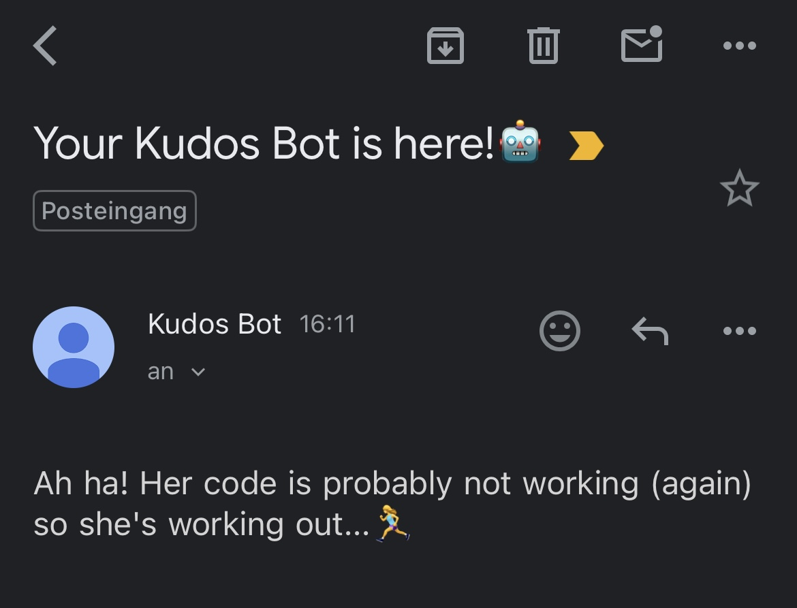

# 🤖 Strava Kudos Bot – Automated Kudos Notification App

**Strava Kudos Bot** is an automated tool that monitors your public/private Strava account for new activities. It automatically sends a friendly reminder to your friends asking for some love when your latest workout has less than 10 kudos. 🥺


---

## 📌 Features

- **Strava API integration** using OAuth2 to access public/private user data with token management
- Automatically fetches latest activity and kudos count every 24 hours via **scheduled GitHub Actions workflow**
- Sends randomized, personalized email notifications to multiple recipients using Nodemailer
- Implemented activity tracking system to prevent duplicate notifications across automated runs

---

## 📸 Email Notification Demo



---

## 🛠️ Tech Stack

| Category            | Technology        |
| ------------------- | ----------------- |
| **Backend**         | Node.js           |
| **API Integration** | Strave API, OAuth |
| **Email**           | Nodemailer        |
| **Automation**      | GitHub Actions    |
| **Version Control** | Git & GitHub      |

---

## 💻 Installation & Setup

### Clone & Install Dependencies

```bash
git clone https://github.com/yufenlai0825/stravakudosbot.git
cd stravakudosbot
npm install
```

### Environment Variables

Create a .env file in the root directory with the following keys:

```bash
CLIENT_ID=               # Your Strava Client ID
CLIENT_SECRET=           # Your Strava Client Secret
ACCESS_TOKEN=            # Your Strava Access Token
REFRESH_TOKEN=           # Your Strava Refresh Token
EMAIL_USER=              # Your Email
EMAIL_PASSWORD=          # Your Email App Password
EMAIL_RECEIVER=          # Email addresses to send
```

---

## ⚙️ Notes for Deployment

- This project relies on a GitHub Actions workflow to run the Kudos Bot automatically on schedule. Therefore, you need to set the secrets inside your repository.
- For local testing, you can run the app after creating a .env file with your credentials.

---
